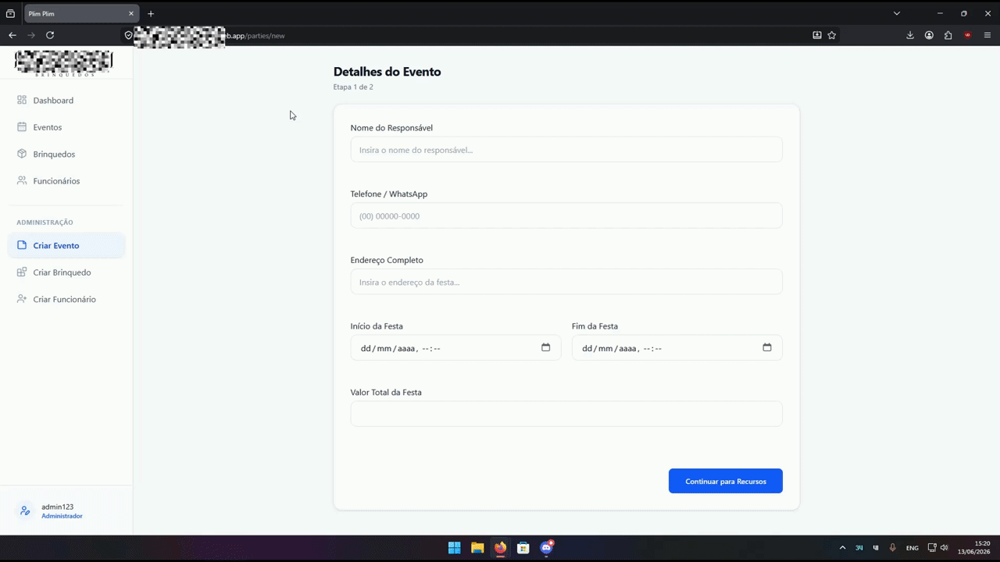
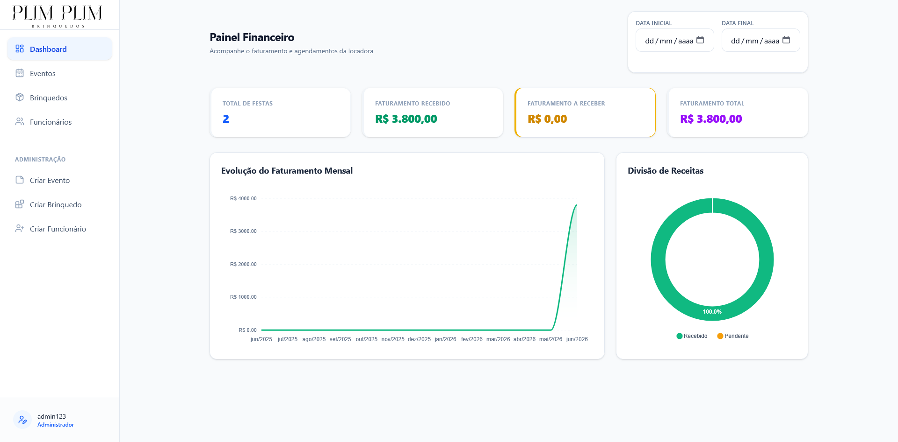

# EventHub

EventHub is a commercial freelance project designed to automate stock control and scheduling for an inflatable toy rental business, prioritizing scalability and SaaS-ready architecture.

## Screenshots

### Party Management


### Party Creation Workflow



### Dashboard



## Features

#### Authentication & Security
- User registration and authentication using JWT
- Secure access to protected endpoints
- Password recovery via email token
- Refresh token support
- Logout with token invalidation

#### Party Management
- Create and manage party events
- Assign employees and inflatable toys to parties
- Track party lifecycle and status changes
- Retrieve party history and event timeline
- Filter parties by status and assembly requirements
- Soft delete support
- Automatic business rule validation

#### Employee Management
- Employee registration and management
- Employee allocation to events
- Conflict prevention for overlapping schedules

#### Toy Management
- Toy registration and inventory control
- Toy allocation to events
- Availability tracking

#### Financial Dashboard
- Revenue reporting by date range
- Financial analytics and summaries
- Event-based income tracking

## Technologies


 


## API Documentation
The API is organized into functional modules. Detailed request and response schemas are available through [Swagger UI](http://localhost:8080/swagger-ui/index.html) documentation.

| Module | Base Path | Key Features |
| :--- | :--- | :--- |
| **Auth** | `/access` | Registration, Login, Refresh, Password Recovery |
| **User Profile** | `/auth/profile` | Update profile, change password, account management |
| **Parties** | `/auth/parties` | Full lifecycle management (Create, Start, End, Cancel) |
| **Employees** | `/auth/employee` | CRUD operations for staff management |
| **Toys** | `/auth/toys` | Inventory management |
| **Dashboard** | `/auth/finance` | Financial reporting |

## API Usage & Business Logic
Beyond standard CRUD operations, the API implements business rules designed for event scheduling and inventory management.

### Create Party (Complex Flow)
This operation automatically validates scheduling conflicts, associates employees and toys with the event, and calculates the final event value.

- **POST `/auth/parties`**

```json
{
  "name": "Event Name",
  "telephone": "12345678900",
  "address": "R. Example, n123",
  "startDateHours": "2026-10-20T14:30:00",
  "endDateHours": "2026-10-20T20:00:00", 
  "toys": [
    { "toyId": 11, "quantity": 3 }
  ],
  "employeeId": [1, 2]
}
```

### Business Rules:
- Automatically calculates the event value based on selected toys and rental duration.
- Assigns employees and inventory resources to the event.
- Prevents employee double-booking.
- Prevents scheduling conflicts for events at the same address and time period.
- Applies default values when optional fields are not provided.

## Project Status
The project has been successfully completed and deployed.
Current status:

- **Backend (Java + Spring Boot):** Completed
- **Frontend (React + TypeScript + Tailwind):** Completed
- **Database (PostgreSQL):** Completed
- **Deployment:** Completed
- **API Documentation (Swagger):** Available

The system is fully functional and ready for production use.

## Technical Challenges

#### Scheduling Conflict Resolution
Implemented validation mechanisms to prevent:
- Employee double-booking
- Resource allocation conflicts
- Overlapping events at the same location

#### Financial Reporting
- Developed optimized database queries to generate financial reports and revenue summaries efficiently.

#### Security
- JWT Authentication
- Refresh Tokens
- Password Recovery via Email
- Spring Security authorization

#### Scalability
- Designed the architecture with future SaaS expansion in mind, allowing support for multi-tenant environments and additional business modules.

##  How to run the project

###  Prerequisites
- Java 21
- Maven
- Docker & Docker Compose
### 1. Clone the repository
```bash
git clone https://github.com/Victor-Policarpo/EventHub.git
```
### 2. Configure environment variables
Configure the environment variables according to the file `.env.example`:

#### Database Config
```
POSTGRES_DB=eventhub
POSTGRES_USER=postgres
POSTGRES_PASSWORD=admin
DB_URL=jdbc:postgresql://localhost:5432/eventhub
```

#### Mail Config
```
MAIL=your_email@gmail.com
MAIL_PASSWORD=your_app_password
```

### 3. Run the application
Execute commands:

```
docker-compose up -d
mvn spring-boot:run
```

The application will be available at:

```http://localhost:8080```

### 4. API Documentation (Swagger)
- After running the application, you can explore and test the endpoints through the Swagger UI:
```
http://localhost:8080/swagger-ui/index.html
```

#### To test protected endpoints:
- Use the `/users` endpoint to register a new user.
- Authenticate via `/users/login` to receive your JWT Token.
- Click the `Authorize` button in Swagger.
- Enter your token in the format: Bearer `your_token_here`

##  Author

Victor Policarpo
- GitHub: [Victor-Policarpo](https://github.com/Victor-Policarpo)
- LinkedIn: [VictorPolicarpo](https://www.linkedin.com/in/victor-policarpo-dev/)

## License

This project is licensed under the MIT License. See the [LICENSE](LICENSE) file for more details.
